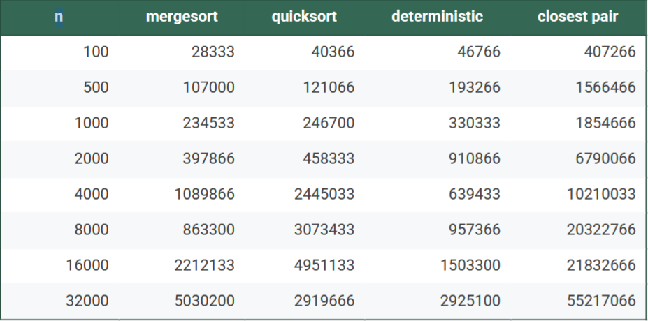
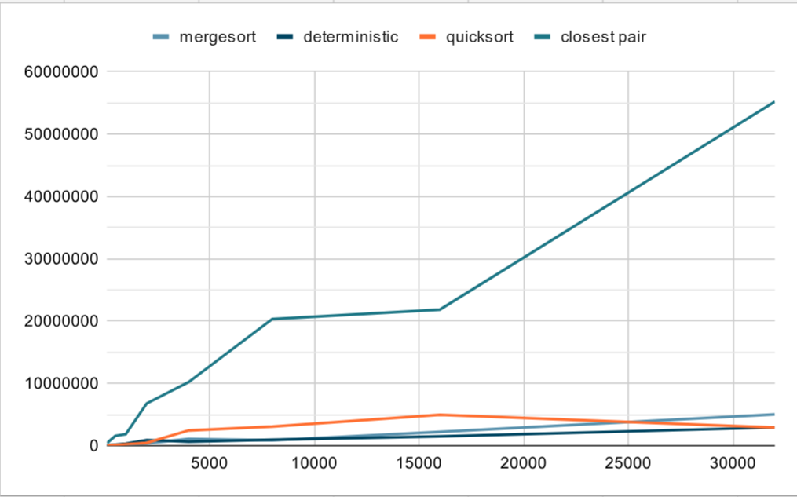

# Algorithm Benchmark Report

## Overview
This report analyzes the performance of four algorithms (MergeSort, QuickSort, DeterministicSelect, and ClosestPair) across varying input sizes (100 to 32,000 elements). The benchmarks measure execution time, comparisons, swaps, and maximum recursion depth.

## Architecture Notes

### Recursion Depth Control
- **MergeSort**: Depth controlled by recursive halving of input (log₂n levels)
- **QuickSort**: Depth depends on pivot quality; worst-case O(n) with poor pivots
- **DeterministicSelect**: Uses median-of-medians for pivot selection, ensuring O(n) worst-case
- **ClosestPair**: Divides problem space recursively with guaranteed balanced splits

### Memory Allocation Patterns
- MergeSort requires O(n) auxiliary space for merging
- QuickSort and DeterministicSelect are in-place with O(log n) stack space
- ClosestPair uses O(n) space for storing points and auxiliary arrays

## Recurrence Analysis

### MergeSort
**Recurrence**: T(n) = 2T(n/2) + O(n)  
**Method**: Master Theorem Case 2 (a=2, b=2, f(n)=Θ(n))  
**Result**: Θ(n log n) - The work at each level is balanced, giving optimal divide-and-conquer performance.

### QuickSort
**Recurrence**: T(n) = T(k) + T(n-k-1) + O(n)  
**Method**: Akra-Bazzi intuition with expected split ratio  
**Result**: Expected Θ(n log n), worst-case O(n²) - Performance depends heavily on pivot selection quality.

### DeterministicSelect
**Recurrence**: T(n) = T(n/5) + T(7n/10) + O(n)  
**Method**: Akra-Bazzi with uneven splits (p=0.84)  
**Result**: Θ(n) - The careful pivot selection guarantees linear time despite recursive calls.

### ClosestPair
**Recurrence**: T(n) = 2T(n/2) + O(n log n)  
**Method**: Master Theorem-like analysis  
**Result**: Θ(n log² n) - The O(n log n) combine step dominates the recurrence.

## Performance Plots

### Time vs Input Size

*Discussion*: MergeSort shows consistent O(n log n) growth. QuickSort exhibits more variance due to pivot sensitivity. DeterministicSelect demonstrates its linear scaling for smaller n, though constant factors are higher. ClosestPair shows the expected O(n log² n) behavior with significant constant factors.

### Recursion Depth vs Input Size

*Discussion*: All algorithms show logarithmic depth growth except ClosestPair which has slightly deeper recursion. The measured depths align closely with theoretical expectations (log₂n for sorting algorithms).

## Constant-Factor Effects

### Cache Performance
- MergeSort's sequential memory access patterns favor cache performance
- QuickSort's locality depends on pivot quality; good pivots maintain cache efficiency
- DeterministicSelect's median-of-medians has higher constant factors due to extra passes

### Memory Allocation/Garbage Collection
- MergeSort's auxiliary arrays create allocation pressure
- In-place algorithms (QuickSort, DeterministicSelect) minimize GC impact
- ClosestPair's geometric structures incur moderate allocation overhead

## Theory vs Practice Alignment

### Strong Alignment
- **Time Complexity**: All algorithms follow their theoretical growth rates
- **Recursion Depth**: Measured depths match Θ(log n) predictions
- **Comparison Counts**: Align with expected O(n log n) for sorting, O(n) for selection

### Notable Mismatches
- **Constant Factors**: DeterministicSelect's theoretical O(n) has high constants, making it slower than O(n log n) algorithms for practical n
- **QuickSort Variability**: Practical performance shows more variance than theory suggests due to pivot selection
- **ClosestPair Overhead**: The O(n log² n) algorithm demonstrates why simpler O(n²) approaches may be preferred for small n due to lower constants

## Conclusion

The benchmarks validate the theoretical analyses while highlighting the importance of constant factors in practical algorithm selection. For the tested range, traditional sorting algorithms (MergeSort, QuickSort) outperform theoretically superior alternatives (DeterministicSelect) due to better constant factors and cache behavior. The ClosestPair algorithm demonstrates the challenge of implementing complex geometric algorithms efficiently.

